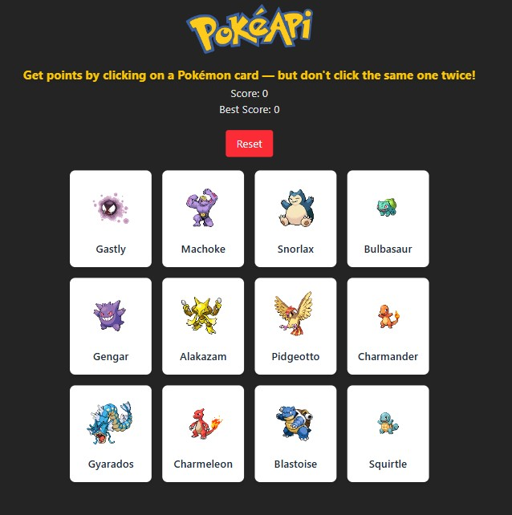

# 🧠 Pokémon Memory Game

A fun memory card game built with **React**, **TailwindCSS**, and **Vite**, using data from the [PokeAPI](https://pokeapi.co/). Click on each unique Pokémon card once — if you click the same one twice, your score resets! The game shuffles cards after every click and continues infinitely to test your memory skills. 🔁

[🔗Live Demo on Netlify](https://your-netlify-link.netlify.app)

---

## 📸 Preview



---

## 🚀 Features

- ⚛️ Built with **React** and **Vite**
- 🎨 Styled with **TailwindCSS**
- 🔄 Cards shuffle after each click
- 🧠 Keeps track of score and best score
- ♾️ Infinite mode — game continues after a full set is completed
- 🎮 Responsive and lightweight

---

## 🛠️ Technologies Used

- [React](https://reactjs.org/)
- [Vite](https://vitejs.dev/)
- [TailwindCSS](https://tailwindcss.com/)
- [PokeAPI](https://pokeapi.co/)
- [Netlify](https://www.netlify.com/) for deployment

---

## 🧑‍💻 Getting Started

Clone the repo and install dependencies:

```bash
git clone https://github.com/yourusername/memory-game.git
cd memory-game
npm install
npm run dev
